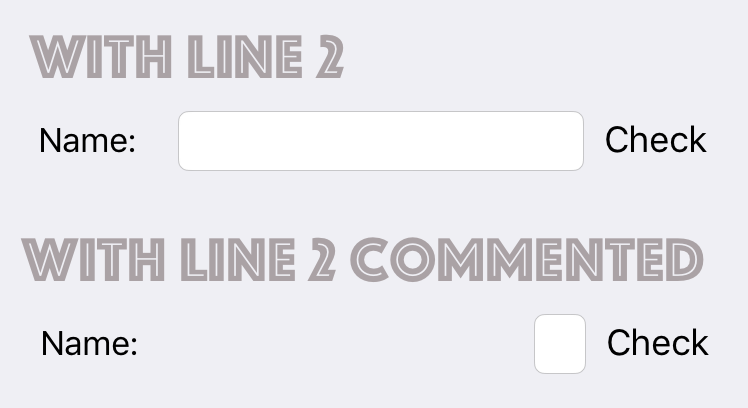

# Ariel

## The Protocol : Ariel

+ Requirements: 
  + `var views: [String: Any]`
  + `var metrics: [String: Any]`
+ Protocol Extension methods
  + `H(String) { // adjust layout priority here }`
  + `V(String) { // adjust layout priority here }`
  + `J(NSLayoutConstraint, UILayoutPriority=.required)`
  + `G([NSLayoutConstraint])`
+ Superclass
  + `ArielViewController`
  + `ArielView`

## Essence Visual Format

Here's an example:

```swift
class ViewController : ArielViewController {
    let buttonSignIn = UIButton()
    let buttonRegister = UIButton()
    
    override func viewDidLoad() {
        super.viewDidLoad()
        
        view.addSubview(buttonSignIn)
        view.addSubview(buttonRegister)
        
        // setTitle, setTitleColor...
        
        H("|-30-[buttonSignIn]-30-|")
        H("|-20-[buttonRegister]-20-|")
        V("|-80-[buttonSignIn]-20-[buttonRegister]")
    }
}
```


With Apple's Auto Layout, the code would look like this:

```swift
// In viewDidLoad
buttonSignIn.translatesAutoresizingMaskIntoConstraints = false
buttonRegister.translatesAutoresizingMaskIntoConstraints = false

let views: [String: Any] = 
	["buttonSignIn": buttonSignIn, "buttonRegister": buttonRegister]

NSLayoutConstraint.activate(
    NSLayoutConstraint.constraints(withVisualFormat: "H:|-30-[buttonSignIn]-30-|", metrics: nil, views: views))
NSLayoutConstraint.activate(
    NSLayoutConstraint.constraints(withVisualFormat: "H:|-20-[buttonRegister]-20-|", metrics: nil, views: views))
NSLayoutConstraint.activate(
    NSLayoutConstraint.constraints(withVisualFormat: "V:|-80-[buttonSignIn]-20-[buttonRegister]", metrics: nil, views: views))
```


## Introduce ContentHuggingPriority Operator

```swift
precedencegroup LayoutPriorityGroup {
    associativity: left
}

infix operator |> : LayoutPriorityGroup

@discardableResult
public func |>(lhs: UIView, rhs: UIView) -> UIView{
    lhs.setContentHuggingPriority(UILayoutPriority(rawValue: rhs.contentHuggingPriority(for: .horizontal).rawValue-1), for: .horizontal)
    return rhs
}

infix operator <| : LayoutPriorityGroup

@discardableResult
public func <|(lhs: UIView, rhs: UIView) -> UIView {
    lhs.setContentHuggingPriority(UILayoutPriority(rawValue: rhs.contentHuggingPriority(for: .horizontal).rawValue+1), for: .horizontal)
    return rhs
}
```

Example,

```swift
H("|-20-[labelName]-20-[fieldName]-10-[btnCheck]-20-|") 
{ labelName <| fieldName |> btnCheck } // line 2
```



## Layout Methods on UIView


####Methods return `NSLayoutConstraint`

+ **Align**: Same attributes of two items.

  `align(NSLayoutAttribute, offset, with item: UIView) `

+ **Match**: Two attributes on same axis(but not identical) of two items.

  `match(NSLayoutAttribute, offset, with target: (UIView, NSLayoutAttribute))`

+ **Scale**:  Width or height attributes relation between two items.

  `scale(NSLayoutAttribute, by multiplier, to target: (UIView, NSLayoutAttribute)) `

+ **Aspect**: items own width-height ratio.

  `aspect(ratio: CGFloat)`

+ **Set**: width or height to constant on item.

  `set(NSLayoutAttribute, to constant: CGFloat)`


####Methods return `[NSLayoutConstraint]`

+ center(in: UIView)
+ edges(equal: UIView, insets: UIEdgeInsets)


####The Stack method

+ The Signature

  `stack(views: [UIView], margin: CGFloat = 0, padding: CGFloat = 0, on axis: UILayoutConstraintAxis) -> (CGFloat...) -> [NSLayoutConstraint] `

+ The `CGFloat...`

  ```swif
  // to stack subviews equally
  view.stack(view.subviews, on: .vertical)
  
  // to stack subviews based on proportions
  view.stack(view.subviews, on: .vertical)(0.1, 0.2, 0.3)
  
  // Notices:
  // If proportions' count less than subviews' count, the remaining subviews divided equally with total of 0.4 (1-0.1-0.2-0.3)
  // If proportions' count greater than subviews' count, the extras arguments is not used.
  ```

  